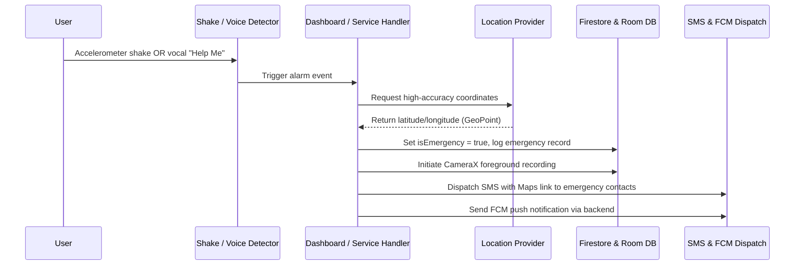
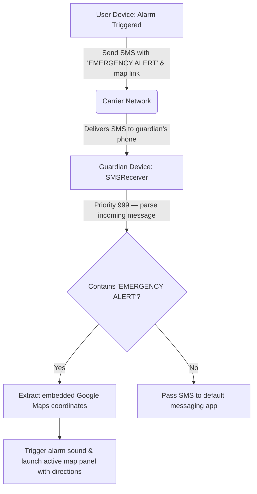
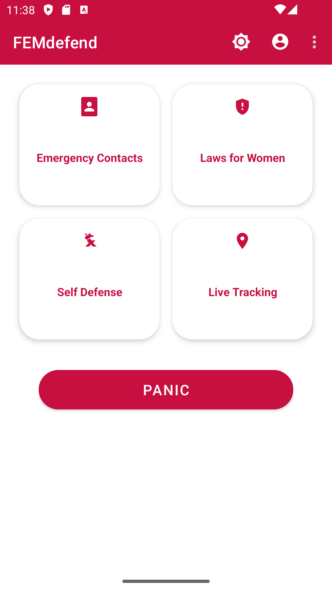
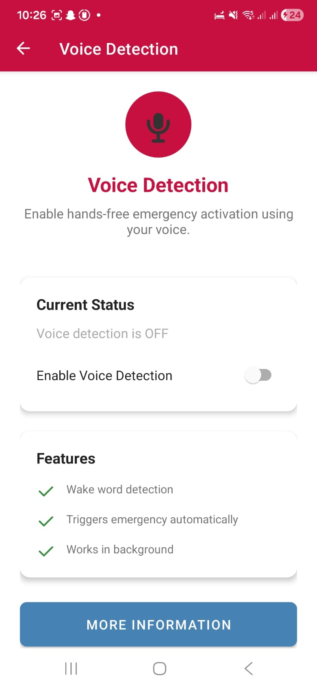
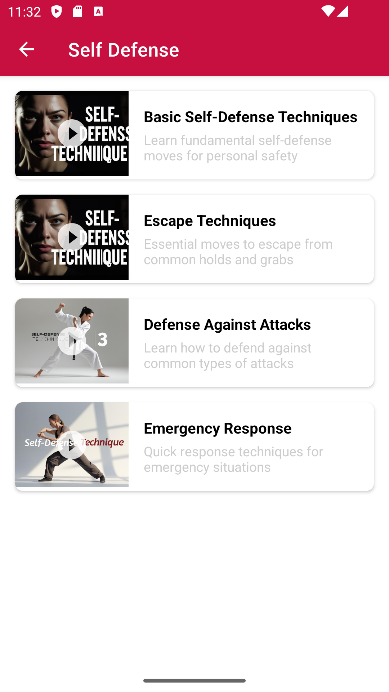
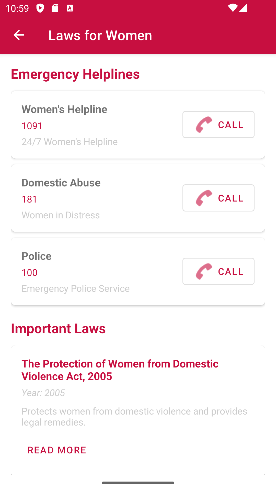
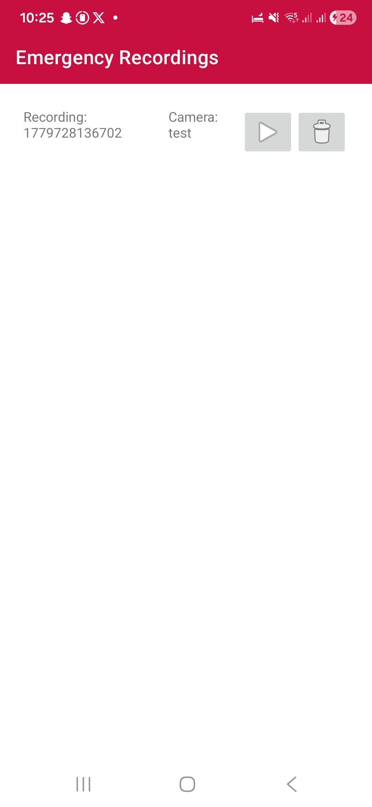

<div align="center">

# FEMdefend

**A Next-Generation, Peer-to-Peer Women's Safety Ecosystem for Android**

[-brightgreen.svg?style=for-the-badge&logo=android)](https://developer.android.com/)
[](https://www.oracle.com/java/)
[](https://firebase.google.com/)
[](https://picovoice.ai/platform/porcupine/)
[](https://developer.android.com/training/data-storage/room)

FEMdefend is a production-ready Android application built to provide immediate personal safety assistance, covert background evidence recording, and on-demand legal and self-defense education. At its core is a **peer-to-peer emergency notification network** that intercepts designated SMS alerts on a guardian's device to trigger an instant alarm — bypassing conventional notification delivery constraints entirely.

[Features](#-features) · [Tech Stack](#️-tech-stack) · [Architecture](#-architecture) · [Database Design](#-database-design) · [Screenshots](#-screenshots) · [Getting Started](#-getting-started) · [Contributing](#-contributing)

</div>

---

## 📋 Table of Contents

- [Features](#-features)
- [Tech Stack](#️-tech-stack)
- [Architecture](#-architecture)
- [Database Design](#-database-design)
- [System Flow Diagrams](#-system-flow-diagrams)
- [Screenshots](#-screenshots)
- [Getting Started](#-getting-started)
- [Contributing](#-contributing)
- [License](#-license)

---

## ✨ Features

### 🎙️ Hands-Free Voice Trigger (Offline Wake-Word Detection)
- Powered by **Picovoice Porcupine v3.0.1**, running a compact deep-learning model entirely on-device — no audio data ever leaves the phone.
- Continuously listens in the background for the wake phrase **"Help Me"** with near-zero battery impact.
- A high-priority cancellation dialog with a countdown timer prevents accidental emergency dispatches before the full alert payload is fired.

### 📹 Intelligent Background Recording with Darkness Detection
- Spawns a background `LifecycleService` using **Android CameraX** to capture video evidence without interrupting the user's screen.
- A **real-time frame-brightness analyzer** computes the average YUV luminance of each camera frame. If the rear camera is obstructed or in complete darkness, the system automatically switches to the front camera to preserve evidence quality.

### 📡 P2P SMS Interception & Guardian Auto-Alerting
- A high-priority (`999`) `BroadcastReceiver` monitors incoming SMS messages for designated emergency tags and embedded Google Maps coordinates.
- When an alert is received on a guardian's device (provided they also have FEMdefend installed), the app intercepts the message, extracts the coordinates, and launches a full-screen panic alarm with map directions — overriding silent or do-not-disturb modes.

### 🗺️ Safe Route Navigation & Active Checkpoint Tracking
- Queries the **Google Directions API** with alternative routes enabled, decodes polyline coordinates asynchronously in `SafeRouteCalculator`, and renders the safest/shortest path in **green** with secondary alternatives in **red**.
- Dispatches the full route waypoint list to a foreground `LocationTrackingService`, which polls high-accuracy GPS every **10 seconds**.
- Checks proximity to each waypoint using `Location.distanceBetween()`. Upon entering a **20-metre radius**, the service advances to the next checkpoint automatically.
- On clearing the final waypoint, the service broadcasts `com.example.femfdefend.DESTINATION_REACHED`, updates the user's status in Firestore, and terminates the tracking thread.

### 🏥 Proximity-Based Emergency Services Querying
- Applies the **Haversine formula** against bounding-box Firestore queries to surface nearby hospitals, police stations, and women's NGOs within a **10 km radius** in real time, and automatically dispatches panic messages to relevant services.

---

## 🛠️ Tech Stack

| Layer | Technology |
| :--- | :--- |
| Language | Java 17 |
| Minimum SDK | Android 7.0 (API 24) |
| Target SDK | API 34 |
| Cloud Backend | Firebase Firestore, Firebase Auth |
| Push Notifications | Firebase Cloud Messaging (FCM) |
| Wake-Word Engine | Picovoice Porcupine 3.0.1 |
| Camera | Android CameraX |
| Local Database | Room Persistence Library |
| Maps & Routing | Google Maps SDK, Google Directions API |

---

## 🏗️ Architecture

FEMdefend follows a **service-oriented architecture** on Android, with a clear separation between UI layers, background services, data models, and utility helpers.

```
app/src/main/
├── AndroidManifest.xml
└── java/com/example/femfdefend/
    ├── MainActivity.java
    ├── SplashActivity.java
    ├── LoginActivity.java
    ├── RegisterActivity.java
    ├── DashboardActivity.java
    ├── ProfileActivity.java
    │
    ├── adapters/               # RecyclerView adapters (Helpline, Laws, Videos)
    ├── dialogs/                # Custom dialog builders (Emergency countdown UI)
    ├── models/                 # Data models (User, EmergencyContact, Law, Video)
    ├── receivers/              # SMSReceiver — P2P background alert interceptor
    │
    ├── services/
    │   ├── FCMService.java                  # Handles remote push notification routing
    │   ├── LocationTrackingService.java     # Foreground GPS checkpoint monitoring
    │   ├── VoiceDetectionService.java       # Wake-lock, continuous wake-word listener
    │   ├── EmergencyRecordingService.java   # Background CameraX recording + brightness analysis
    │   └── EmergencyServiceHandler.java     # Coordinates emergency broadcast dispatch
    │
    └── utils/
        ├── DatabaseInitializer.java
        ├── DummyDataGenerator.java
        ├── FirebaseHelper.java              # Abstraction layer for Firestore operations
        └── SMSHelper.java
```

---

## 🗄️ Database Design

### Cloud Firestore (NoSQL)

#### `users` Collection

Stores authentication profile data and real-time coordinates during active tracking sessions.

| Field | Type | Description |
| :--- | :--- | :--- |
| `uid` | String | Unique Firebase Auth identifier |
| `fullName` | String | User's full name |
| `email` | String | Registered email address |
| `phone` | String | Registered phone number |
| `isEmergency` | Boolean | `true` when the user has an active panic alert |
| `lastLocation` | GeoPoint | Most recently recorded latitude/longitude |
| `lastEmergencyTime` | Long | Unix timestamp of the last panic trigger |

#### `users/{userId}/emergency_contacts` Sub-collection

| Field | Type | Description |
| :--- | :--- | :--- |
| `id` | String | Auto-generated contact identifier |
| `name` | String | Contact display name |
| `phone` | String | Contact phone number |
| `relationship` | String | Relationship label (e.g., Family, Friend, Spouse) |

---

### Local Room Database (SQLite)

#### Table: `emergency_recordings`

Caches metadata and file paths of all CameraX-recorded evidence on-device.

| Column | Type | Constraints | Description |
| :--- | :--- | :--- | :--- |
| `id` | Integer | Primary Key, Autogenerate | Recording sequence ID |
| `filePath` | String | NOT NULL | Absolute path to the MP4 file in internal storage |
| `timestamp` | Long | NOT NULL | Unix timestamp (ms) when recording began |
| `duration` | Long | NOT NULL | Total recording length in milliseconds |
| `cameraUsed` | String | NOT NULL | Source camera (`front` or `back`) |

---

## 🔄 System Flow Diagrams

### Emergency Activation Sequence



### P2P SMS Interception Flow



---

## 📸 Screenshots

> **Adding screenshots:** Create a `screenshots/` folder at the project root and place your PNG/JPG files inside. GitHub will render the images automatically.

<p align="center">
  
  &nbsp;
  
  &nbsp;
  
</p>
<p align="center">
  
  &nbsp;
  
  &nbsp;
  
</p>

---

## 🚀 Getting Started

### Prerequisites

- Android Studio Hedgehog (2023.1.1) or later
- JDK 17
- An active [Firebase project](https://console.firebase.google.com/) with Firestore and Authentication enabled
- A valid [Google Maps API key](https://developers.google.com/maps/documentation/android-sdk/get-api-key) with the Directions API enabled
- A [Picovoice access key](https://console.picovoice.ai/)

### Installation

1. **Clone the repository**
   ```bash
   git clone https://github.com/your-username/femdefend.git
   cd femdefend
   ```

2. **Connect Firebase**
   - Download your `google-services.json` from the Firebase console and place it in the `app/` directory.

3. **Configure API keys**
   Add the following to your `local.properties` file (never commit this file):
   ```properties
   MAPS_API_KEY=your_google_maps_api_key
   PICOVOICE_ACCESS_KEY=your_picovoice_access_key
   ```

4. **Sync and build**
   Open the project in Android Studio, let Gradle sync complete, then build and run on a physical device (API 24+).

> **Note:** Several features — including wake-word detection, SMS interception, and background recording — require a physical device. They will not function correctly on an emulator.

---

## 🤝 Contributing

Contributions are welcome and appreciated. To get started:

1. Fork the repository.
2. Create a feature branch: `git checkout -b feature/your-feature-name`
3. Commit your changes with a clear message: `git commit -m 'Add: description of change'`
4. Push to your fork: `git push origin feature/your-feature-name`
5. Open a Pull Request against the `main` branch.

Please ensure your code follows the existing style conventions and that any new features are accompanied by appropriate documentation.

---

<<<<<<< HEAD
=======


>>>>>>> fd9ae1f (resolved merge conflict)
<div align="center">
  Built with ❤️ for women's safety.
</div>
